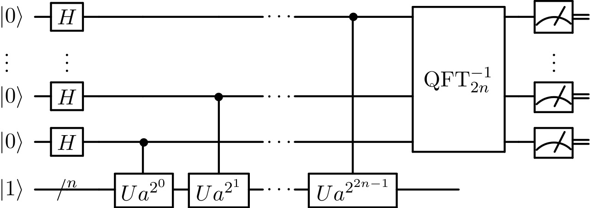
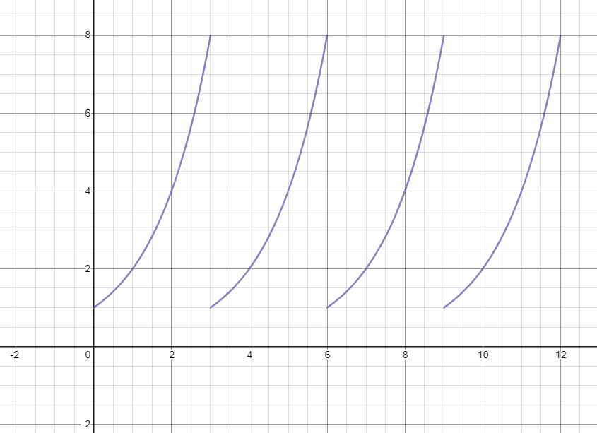

# Shors Algorithm
In this repositroy, I want to take the opportunity to describe Shor's algorithm, and the basics for how it works. This is a brief overview of the algorithm. 

There is some code in this repository and the code is based on the paper called, "Circuit for Shor’s algorithm using 2n+3 qubits".

This is not my code. I was not able to write all the code for the algorithm by myself... it was too complicated. The code in this repository was the code I used to replicate Shor's algorithm on my jupyter notebook and I am sharing it so you can try it too!

# Problem
RSA encryption is a method of encrypting messages provided two unique values for N and e. This encryption works by creating a 1-way function where encrypting is easy while decrypting becomes almost imposible. The securtiy is based on the exponentially hard problem called factorization which takes advantage of bit-based computational capabilities.

By the way, this is a short description of the logic behind it which you can also check out in a [video](https://www.youtube.com/watch?v=zqS4w4SiJT0) I made. Check it out!

## Preface
As a preface, I can start by defining a bunch of variables:

**N** = Public RSA encryptor

**e** = Public RSA exponent where e is an odd number that does not share a factor with φ(N). AKA, (q-1)(p-1).

**p** = RSA encryptor prime factor

**q** = RSA encryptor prime factor

**a** = Co-prime number to N, base for the exponent for Shor's function (Random number less than N that shares only one other factor with N, 1)

**r** = Period of Shor's function function

**m** = Message

**c** = Encrypted message

There are more but in trying to make this as easy to understand as possible, these variables are enough.

### Public key
This is the key that is given to everyone, the values of both N and e. Anyone that wants to send a message is given these two pieces of information to encode m into c.

The formula to encrypt a message is given by:

c = me mod(N)

This is the easy part of the one way function.

The hard part is going backwards to find m. 

The formula to decrypt a message is given by:

m = cd mod(N)

But, its not so simple, finding d requires to know both prime factors of N, p and q. And for a computer, this is alomst impossible to compute in a limited time period with current RSA numbers like the hundreds of digit numbers for N.

### Shor's Function
The general function formula is:

S(x) = ax mod(N)

When you sub in your own values for N and a it becomes:

f(x) = 2x mod(15)

### And Even More Prep

Lets define the public keys and go through the RSA framework once.

**N** = 15

**e** = 7

Private message: 

**m** = 13

c = 137 mod(15)

c = 7

This is the message your computer would craft and send to something like a bank to decode. Now lets figure out how to intercept this message with a quantum computer and find the message for ourselves.

These are the steps a computer would do to find the factors to decrypt the message.

Lets assume the role of the hacker. We are only given the public information of N = 15 and e = 4.

## Step 1
The first step is finding an integer a such that a < N. They have to be co-prime.

**a** = 2

## Step 2 - Quantum Step

This step can be brocken down into 3 more steps.

### Part 1 - Hadamard Gates
First we have to figure out how many qubits we need. We need to find log2 N for our value of N. Then, 4*n+2 is how many qubits we need. We also need 2*n bits to hold all the information we measure off of the QFT. This means we use 18 qubits.

The first portion of gates is pretty simple. You are just using Hadamard gates on all of the qubits in the top register, 2*n qubits or in our case 8 of our 18 qubits.

### Part 2 - Phase Estimation
This is the middle part of the circuit where there are a bunch of control unitary opperator gates. This subroutine is also known as phase estimation.

To make this super easy to understand, this part of the circuit just sets up a periodic function in the qubits to further manipulate in the following steps. 

For a more complicated explanation involving some linear algebra, this is a quantum algorithm to estimate the phase or eigenvalue of a unitary operator. The unitary opperator we are attempting to find the eigenvalue of is the Shor's function using our input variables.

This is a probabilistic algorithm which gives a correct answer with high probability and decreases the chance of faliure by repeating.

Using the function, f(x) = 2x mod(15), you are given a periodic graph.

Given a graph of the periodic function, we can go onto the next part.

### Part 3 - Quantum Fourier Transform
To make it simple. The QFT or quantum Fourier Transform is a linear transformation applied to qubits. It is a subroutine used in many algorithms like phase estimation and it helps by applying the discrete Fourier transform to a more complex vector space.

To make it as simple as possible, the QFT helps find a value related to the period of a given function to efficiently find it. When we use the QFT on our value for the graphs above, just think of it figuring out the period of the function. Period r = 4.

### Part 4 - Measure
In this part, the final states are measured after the QFT and we are basically given the period which is the hardest part.

## Step 3
If the period r is odd, restart and go to **Step 1**. Find a new **a** value.
If the period r is even, go to **Step 4**.

## Step 4
Now, lets jump into a bit of math.

If we get the period of a function, the following equation must be true: 

ar = 1 mod(N)

This is becasue if the period is r = 4, then that means what ever the value is at 0, the same value of 1 is also given at r.

Given our function, 20 = 1 mod(15) similar to how 24 = 1 mod(15) because that is when the function will repeat itself.

If we then use perfect squares to expand our equation, this is where we land up.

ar = 1 mod(N)

ar - 1 = 0 mod(N)

(ar/2 - 1)(ar/2 + 1) = 0 mod(N)

If we sub in our values into this equation, we would find:

(24/2 - 1)(24/2 + 1) = 0 mod(15)

And when we futher simplify, we would get:

(3)(5) = 0 mod(N)

## Step 5
But, we are not finished yet. It may seem like we are finished because we have the correct factors but we only got lucky because 15 is just a very simple number. The final step is actually finding the GCD of either of these numbers with N to finally find the prime factors of N.

Euclidean GCDs:

GCD(15, 5) = 5

GCD(15, 3) = 3

And there you have it. Using Euclid's algorithm, we can find the prime factors of any prime number N using Shor's algorithm in a more efficient way not requiring a very time complex method.

## Step 6
Decoding the message is the final step. I said all the way at the top that the equation to decode the RSA encrypted message is given by the following equation, m = cd mod(N), but the hard part is finding the d value.

The d value is made up by a brand new concept called the phi fucntion so let me give you a shor lesson of the Euler's totient function if you don't already know about it.

Phi (φ), AKA Euler's totient function, is a greek letter that represents the "breakability of a number". The number of co-prime numbers to your original number. For prime numbers, the φ value is equal to the number minus 1. φ(7) = 7 - 1 = 6 (1, 2, 3, 4, 5, 6, ~~7~~).

When we use this property with our number N, we know that it is made up of 2 prime numbers. This means the φ function is just 
φ(N) = (p-1)(q-1) where p and q are just factors of N.

Now to find the value of d, we will actually need to find the value of the toient function because the following is the equation of the d value:

d = (k * φ(N) + 1) / e where k is an integer and e is an odd number that does not share a factor with φ(N).

If we sub in our own values in this equation,

d = (6 * (3 - 1)(5 - 1) + 1) / 7

d = 7

And finally, when I sub all of our values into the decrpyting equation:

m = cd mod(N)

m = 77 mod(15)

m = 13

And once again, there we have it. We have successfully managed to interfere with this simple RSA encrypted message and used the theory behind how a quantum computer would go about finding the factors to decrypt the message.

Making this problem into a period finding problem rather than a straight up factoring problem lies in the genius of this solution that Peter Shor came up with. Using the quantum technology to solve what current computers are unable to solve is what makes this algorithm so cool and much better than current methods.

If you are interested in how to recreate this on a quantum computer, check out the code in the resources tab and chck out my other repositories if you are interested! Thanks 😊.
