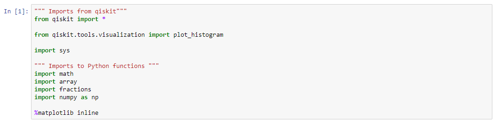

# Shors Algorithm
In this repositroy, I want to take the oppertunity to describe Shor's algorithm, and the understanding that I have gotten from the code. I'm going to describe all of the major code blocks to describe how the circuit works to give you the prime numbers you are looking for.

This code is based on the paper called, "Circuit for Shor’s algorithm using 2n+3 qubits".

I was not able to write all the code for the algorithm by myself... because it was too complicated, so I replicated the code. I will attempt to provide a similar in brief understanding for how the algorithm works.

## Block 1
This part just imports the files that will be needed for the circuit.

